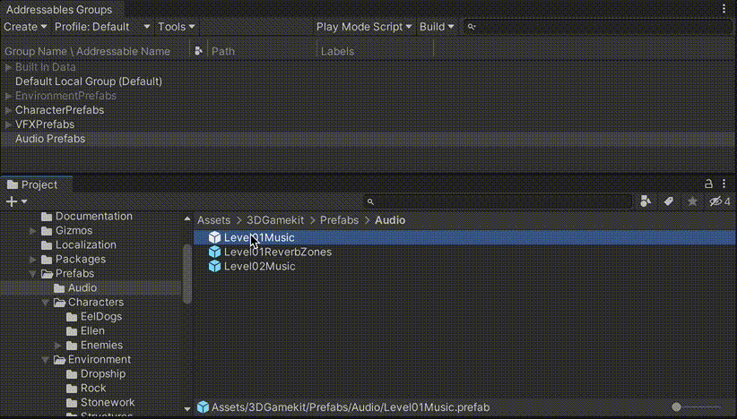
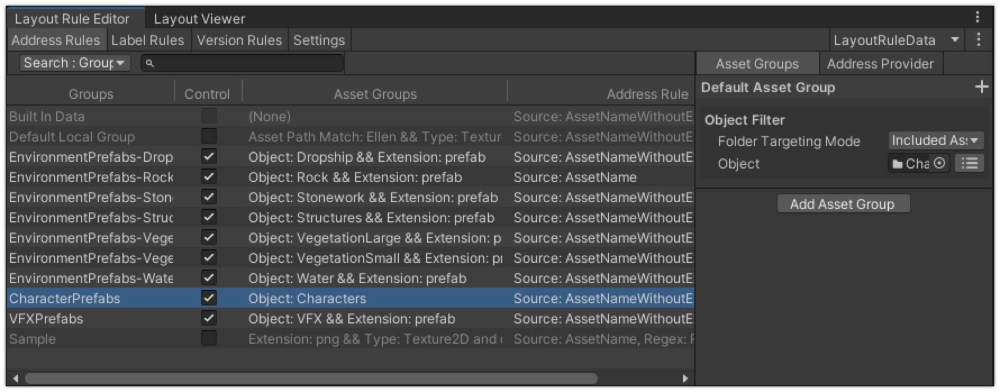
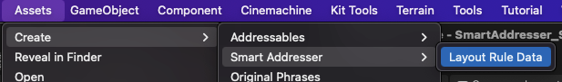
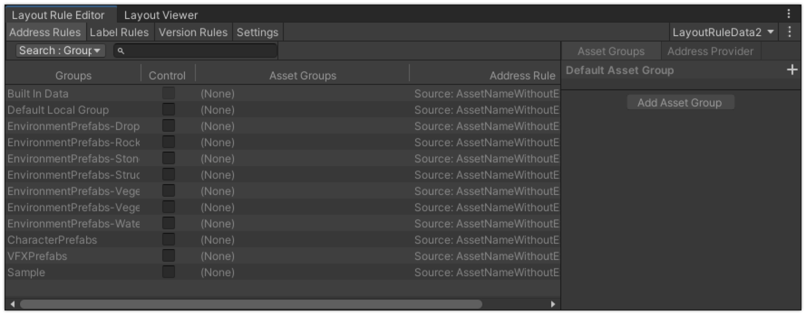
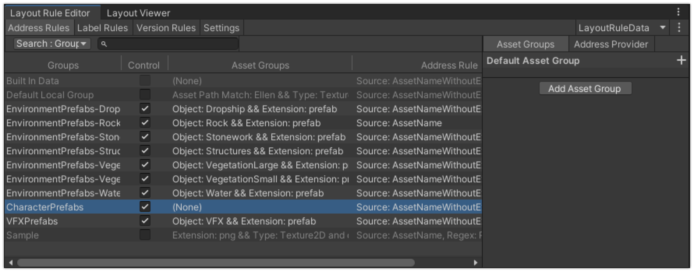
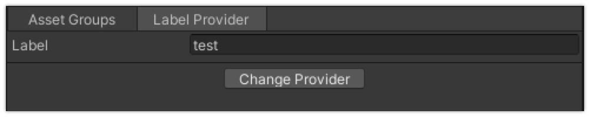
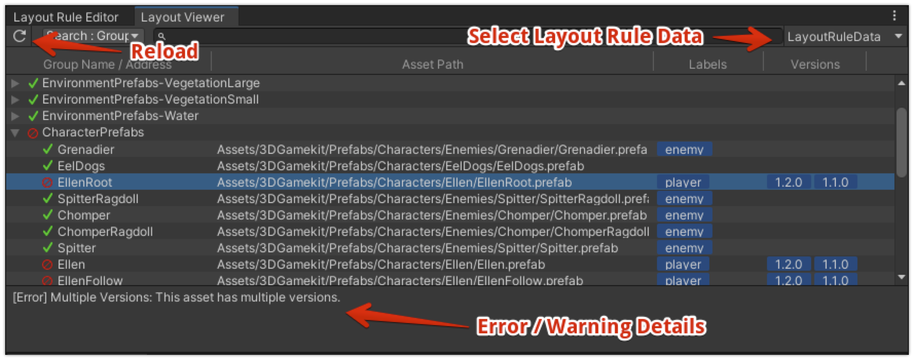
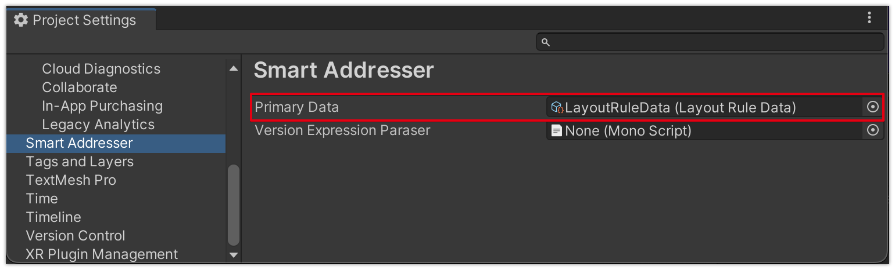
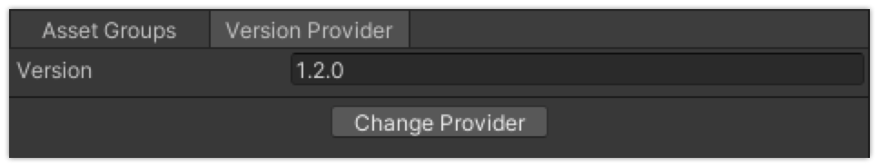
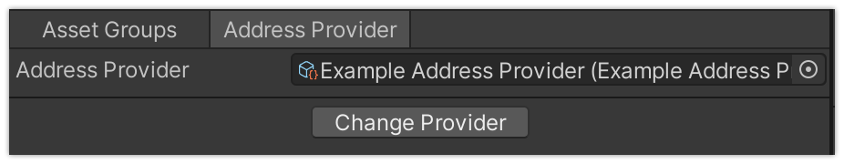

<p align="center">
  
  
</p>

# Smart Addresser: Automate Addressing, Labeling, and Version Control for Addressables

[](LICENSE.md)
[](https://github.com/CyberAgentGameEntertainment/AssetRegulationManager/pulls)
[](#Requirements)

**Docs** ([English](README.md), [日本語](README_JA.md))

Smart Addresser is a tool for automating the assigning of addresses and labels in the Unity's Addressable Asset System.
You can assign addresses and labels easily using GUI tool.
And it also has the version management feature to exclude pre-release assets from the build.

<p align="center">
  
</p>

## Table of Contents
<!-- START doctoc generated TOC please keep comment here to allow auto update -->
<!-- DON'T EDIT THIS SECTION, INSTEAD RE-RUN doctoc TO UPDATE -->
<details>
<summary>Details</summary>

- [Concept](#concept)
- [Setup](#setup)
  - [Requirement](#requirement)
  - [Install](#install)
- [Set up rules to assign addresses](#set-up-rules-to-assign-addresses)
  - [Set up Addressable Asset System](#set-up-addressable-asset-system)
  - [Create an asset to store the data](#create-an-asset-to-store-the-data)
  - [Create Address Rules](#create-address-rules)
  - [Create Label Rules](#create-label-rules)
- [Validation](#validation)
- [Apply to Addressable Asset System](#apply-to-addressable-asset-system)
  - [Apply from Layout Rule Editor](#apply-from-layout-rule-editor)
  - [Apply rules automatically](#apply-rules-automatically)
  - [Apply by CLI](#apply-by-cli)
  - [Detecting corrupted layout rules](#detecting-corrupted-layout-rules)
- [Version Management](#version-management)
  - [Versioning Specification](#versioning-specification)
  - [Create Version Rules](#create-version-rules)
  - [Apply with specified version range](#apply-with-specified-version-range)
  - [About versioning and asset dependencies](#about-versioning-and-asset-dependencies)
  - [Use your own version range expression](#use-your-own-version-range-expression)
- [Command Line Interface (CLI)](#command-line-interface-cli)
  - [Set Version Expression](#set-version-expression)
  - [Detecting corrupted layout rules](#detecting-corrupted-layout-rules-1)
  - [Apply Layout Rules to Addressable Asset System](#apply-layout-rules-to-addressable-asset-system)
- [Scripting](#scripting)
  - [Edit Layout Rule Data](#edit-layout-rule-data)
  - [Validation and Apply to Addressable Asset System](#validation-and-apply-to-addressable-asset-system)
- [List and descriptions of Asset Filter and Providers](#list-and-descriptions-of-asset-filter-and-providers)
  - [Asset Filter of Asset Group](#asset-filter-of-asset-group)
  - [Address Provider](#address-provider)
  - [Label Provider](#label-provider)
  - [Version Provider](#version-provider)
- [Create your own Asset Filters / Providers](#create-your-own-asset-filters--providers)
  - [Create your own Asset Filter](#create-your-own-asset-filter)
  - [Create your own Provider](#create-your-own-provider)
- [License](#license)

</details>
<!-- END doctoc generated TOC please keep comment here to allow auto update -->


## Concept
In the Addressable Asset System, you can register addresses by dragging and dropping assets into the **Addressables Group Window** as shown blow.

<p align="center">
  
</p>

However, in reality, it is difficult to manually register all assets.
Smart Addresser is a tool to automate this task.
For example, you can easily assign addresses by setting up the rules like the following.

* Assign addresses to all Prefabs in the specified folder.
* Assign addresses to all assets in the folder named "Addressables".
* Assign addresses to all assets with a path matching the specified regular expression.

You can freely create rules using the GUI tool as follows.

<p align="center">
  
</p>

And Smart Addresser also has the version management feature.
You can exclude pre-release assets from the build by setting the version number of the asset.

There is also a tool that allows you to check and validate the actual addresses, labels, and versions that are assigned by the rules.

<p align="center">
  
</p>

You can also use the **CLI** to incorporate the addressing and validation process into the CI/CD process.

## Setup

### Requirement
* Unity 2020.3 or higher.
* Addressables is installed.

### Install
1. Open the Package Manager from Window > Package Manager
2. "+" button > Add package from git URL
3. Enter the following
    * https://github.com/CyberAgentGameEntertainment/SmartAddresser.git?path=/Assets/SmartAddresser

<p align="center">
  
</p>

Or, open Packages/manifest.json and add the following to the dependencies block.

```json
{
    "dependencies": {
      "jp.co.cyberagent.smartaddresser": "https://github.com/CyberAgentGameEntertainment/SmartAddresser.git?path=/Assets/SmartAddresser"
    }
}
```

If you want to set the target version, write as follows.

* https://github.com/CyberAgentGameEntertainment/SmartAddresser.git?path=/Assets/SmartAddresser#1.0.0

To update the version, rewrite the version as described above.  
If you don't want to specify a version, you can also update the version by editing the hash of this library in the package-lock.json file.

```json
{
  "dependencies": {
      "jp.co.cyberagent.smartaddresser": {
      "version": "https://github.com/CyberAgentGameEntertainment/SmartAddresser.git?path=/Assets/SmartAddresser",
      "depth": 0,
      "source": "git",
      "dependencies": {},
      "hash": "..."
    }
  }
}
```

## Set up rules to assign addresses

### Set up Addressable Asset System

> **Note**  
> If you already have set up Addressable Asset System, skip this section.

Before you use **Smart Addresser**, you need to set up the Addressable Asset System.
If not, set up it as follows.

* Open **Window > Asset Management > Addressables > Groups**.
* If you see a message that **Addressable** has not been initialized, follow the instructions to initialize it.
* If necessary, create a new **Addressable Asset Group** to be controlled by **Smart Addresser** from **Create > Groups**.

### Create an asset to store the data
Next you need to create an asset to store the data for **Smart Addresser**.
Create **Layout Data Asset** from **Assets > Create > Smart Addresser > Layout Rule Data**.

<p align="center">
  
</p>

Rules for addressing are stored in this asset.

You can create multiple assets in the same project.
And you can create it in any folder under the **Editor** folder.

Next, double-click the asset or click the **Open Editor** button in the Inspector to open the **Layout Rule Editor**.

<p align="center">
  
</p>

### Create Address Rules
In the **Address Rules** tab of the **Layout Rule Editor**, you can set the assets and their addresses to be registered in each **Addressable Asset Group** (called **Address Rule**) in the project.

The **Groups** column displays a list of **Addressable Asset Groups** in your project.
If you check the checkbox in the **Control** column, **Smart Addresser** will control the **Addressable Asset Group**.

<p align="center">
  
</p>

Next, select a item and set up the rules for that **Addressable Asset Group** in the panel on right.

In the **Asset Groups** tab you can specify which assets to target.
For example, to target "all assets in the folder named Characters", click the **+** button and select the **Object Filter**, and set the **Characters** folder to the **Object** property, as shown below.

<p align="center">
  
</p>

See [Asset Filter of Asset Group](#asset-filter-of-asset-group) for details on filters other than **Object Filter**.
You can also set multiple filters, and they will be combined with **AND**.
If you want to use **OR**, click **Add Asset Group** to add another **Asset Group**.

In the **Address Provider** tab, you can specify the address to be assigned to the assets.
For example, if you want to assign the file name without extension as the address, set **File Name Without Extensions** to the **Source** as shown below.

<p align="center">
  
</p>

See [Address Provider](#address-provider) for details on address providers.

### Create Label Rules

> **Note**  
> If you don't use labels, skip this section.

In the **Label Rules** tab of the **Layout Rule Editor**, you can set the rules to assign labels to assets (called **Label Rules**).

First, click the **+** button at the top left to add new **Label Rule**.
You can rename it by clicking the item.

<p align="center">
  
</p>

Next, select a item and set up the rules for that **Label Rule** in the right panel.

In the **Asset Groups** tab you can specify which assets to target.
Usage is the same as the **Address Rules** tab.

In the **Label Provider** tab you can specify the labels to be assigned to the assets.
For example below, set the **Label** named **test**.

<p align="center">
  
</p>

## Validation

Now, when you set up addresses, etc. as described above, the following problems may occur.

* Multiple addresses are specified for a single asset.
* Multiple assets are specified for a single address.
* Multiple [Versions](#version-management) are specified for a single address.

We provide **Layout Viewer** as a tool to detect such rule misconfigurations.

You can open it from **Window > Smart Addresser > Layout Viewer**.
When the **Layout Viewer** is opened, validation is performed and the list of the **Addressable Group**, the list of addresses and the validation results are displayed.

<p align="center">
  
</p>

Use this tool to adjust the layout rules and eliminate warnings and errors.

## Apply to Addressable Asset System

Now that you have set up the rules, you can apply them to the Addressable Asset System.

### Apply from Layout Rule Editor

From the **Layout Rule Editor**, you can apply the rules by following the steps below.

1. Click the menu button on the top right.
2. Select **Apply to Addressables**.

<p align="center">
  
</p>

It is possible to set whether to treat each of avobe issue as an error or a warning in **Project Settings > Smart Addresser > Validation Settings**.

### Apply rules automatically
You can also apply rules automatically when you import assets or edit the rules.
To do this, set the **Layout Rule Data** which you want to apply to the **Primary Data** of the **Project Settings**.

<p align="center">
  
</p>

### Apply by CLI

You can also apply rules by CLI.
See details in [Command Line Interface](#command-line-interface--cli-).

### Detecting corrupted layout rules

There are cases where the layout rules are corrupted, such as when the object set in the Object Filter is deleted.

<p align="center">
  
</p>

You can check for corrupted layout rules by setting **Project Settings > Smart Addresser > Layout Rule Corruption**.

<p align="center">
  
</p>

The items are as follows.

| Item Name        | Description                                                                 |
|------------------|-----------------------------------------------------------------------------|
| Throws Exception | Throw an exception if the layout rule is corrupted. The application process is not performed. |
| Log Error        | Output an error log if the layout rule is corrupted. The application process is performed. |
| Ignore           | Ignore the corrupted layout rule and apply the process.                     |

## Version Management

**Smart Addresser** can provide version to each asset.
You can register only specified assets to the Addressable Asset System by specifying the version when you apply the rules.

### Versioning Specification

Expression of versioning follows [Semantic Versioning](https://semver.org/).
For example, you can use the following versioning.

* 1.2.3
* 2.1.0-preview.7

Expression of version range follows [Version Define expressions](https://docs.unity3d.com/Manual/ScriptCompilationAssemblyDefinitionFiles.html#version-define-expressions).
So you can express the version x range as follows.

* [1.3,3.4.1] means 1.3.0 <= x <= 3.4.1
* (1.3.0,3.4) means 1.3.0 < x < 3.4.0
* [1.1,3.4) means 1.1.0 <= x < 3.4.0
* (0.2.4,5.6.2-preview.2] means 0.2.4 < x <= 5.6.2-preview.2
* [2.4.5] means x = 2.4.5
* 2.1.0-preview.7 means x >= 2.1.0-preview.7
* You cannot use space.
* Wildcard is not supported.

### Create Version Rules

You can specify the version of each asset in the **Version Rules** tab of the **Layout Rule Editor**.

First, click the **+** button at the top left to add new **Version Rule**.
You can rename it by clicking the item.

<p align="center">
  
</p>

Next, select a item and set up the rules for that **Version Rule** in the right panel.

In the **Asset Groups** tab you can specify which assets to target.
Usage is the same as the **Address Rules** tab.

In the **Version Provider** tab you can specify the version to be assigned to the assets.
For example below, set the version to **1.2.0**.

<p align="center">
  
</p>

You can also use the other version providers by clicking the **Change Provider** button.
See [Version Provider](#version-provider) for details on version providers.

### Apply with specified version range

To specify the version range, set the **Version Expression** in the **Settings** tab of the **Layout Rule Editor**.
If you check **Exclude Unversioned**, assets without version will be excluded.
Following is an example that targets the assets with version greater than or equal to 1.2.0 and less than 3.4.0 and unversioned assets.

<p align="center">
  
</p>

Now, when you apply the rules, only assets with specified versions will be registered to the Addressable Asset System.

### About versioning and asset dependencies

The version management feature of **Smart Addresser** is designed to exclude pre-released assets from the build.
For example, if you specify the version range as **[1.0.0,1.2.0]** assets with version greater than 1.2.0 will be excluded from the build.

When using this, you need to be careful not to reference a higher version asset from a lower version asset.
Such dependencies will cause unintended asset updates.
For example, a version **1.2.0** of asset A references a version **1.3.0** of asset B.
If you build **1.2.0** and then build **1.3.0**, not only asset B but also asset A will be updated.

Normally, such as dependencies are not constructed, but beware.

### Use your own version range expression
As noted above, the version range expression follows [Version Define expressions](https://docs.unity3d.com/Manual/ScriptCompilationAssemblyDefinitionFiles.html#version-define-expressions).

If you want to use your own version range expression, you can implement the `IVersionExpressionParser` interface and set the script to the **Project Settings > Smart Addresser > Version Expression Parser**.

## Command Line Interface (CLI)

### Set Version Expression

You can set the version expression by calling the following method.

`SmartAddresser.Editor.Core.Tools.CLI.SmartAddresserCLI.SetVersionExpression`

The following is an example of how to set the version expression from the command line in Mac.

```
/Applications/Unity/Hub/Editor/2020.3.40f1/Unity.app/Contents/MacOS/Unity -projectPath [Your Project Path Here] -executeMethod Assets/SmartAddresser/Editor/Core/Tools/CLI/SmartAddresserCLI.SetVersionExpression
```

Command line arguments are as follows.


| Argument Name                            | Description                                                                                     |
|------------------------------------------|-------------------------------------------------------------------------------------------------|
| -layoutRuleAssetPath \<assetPath\>       | Asset Path of the Layout Rule Data to be applied.<br>If not specified, use the first one found. |
| -versionExpression \<versionExpression\> | Version Expression.                                                                             |

When completed, Unity is automatically closed and returns the following value.

- If successful: 0
- If failed: 1

### Detecting corrupted layout rules

You can use the `SmartAddresser.Editor.Core.Tools.CLI.SmartAddresserCLI.ValidateLayoutRules` method to check for corrupted layout rules from the command line.

The following is an example of how to check for corrupted layout rules from the command line in Mac.

```
/Applications/Unity/Hub/Editor/2020.3.40f1/Unity.app/Contents/MacOS/Unity -projectPath [Your Project Path Here] -executeMethod Assets/SmartAddresser/Editor/Core/Tools/CLI/SmartAddresserCLI.ValidateLayoutRules
```

Command line arguments are as follows.

| Argument Name                            | Description                                                                                     |
|------------------------------------------|-------------------------------------------------------------------------------------------------|
| -layoutRuleAssetPath \<assetPath\>       | Asset Path of the Layout Rule Data to be applied.<br>If not specified, use the first one found. |
| -errorLogFilePath \<filePath\>     | Output file path for validation result.<br>Default is Logs/SmartAddresser_LayoutRuleError.json. |

When completed, Unity is automatically closed and returns the following value.

- If successful: 0
- If the layout rule is corrupted: 1
- If an error occurred during execution: 2

### Apply Layout Rules to Addressable Asset System

You can apply the layout rules to the Addressable Asset System by calling the following method.

`SmartAddresser.Editor.Core.Tools.CLI.SmartAddresserCLI.ApplyRules`

The following is an example of how to apply the layout rules from the command line in Mac.

```
/Applications/Unity/Hub/Editor/2020.3.40f1/Unity.app/Contents/MacOS/Unity -quit -batchmode -projectPath /Users/s14774/Unity/SmartAddresser_Sample -executeMethod SmartAddresser.Editor.Core.Tools.CLI.SmartAddresserCLI.ApplyRules
```

Command line arguments are as follows.

| Argument Name                     | Description                                                                                                                             |
|-----------------------------------|-----------------------------------------------------------------------------------------------------------------------------------------|
| -layoutRuleAssetPath \<assetPath\> | Asset Path of the Layout Rule Data to be applied.<br>If not specified, use the first one found.                                         |
| -validateLayoutRule               | If enabled, check for corrupted layout rules before applying.                                                                           |
| -validateLayout                   | If enabled, validation will be executed before applying.<br>The validation is a time-consuming process so can be skipped if not needed. |
| -resultFilePath \<filePath\>      | Output file path for validation result.<br>Default is SmartAddresser/validate_result.json.                                              |
| -failWhenWarning                  | If enabled, any warning in the validation is considered an execution error.                                                             |

When completed, Unity is automatically closed and returns the following value.

- If successful: 0
- If validation failed: 1
- If execution failed: 2

## Scripting

**Smart Addresser** can also be operated from scripts.

### Edit Layout Rule Data

The following is an example of how to edit the layout rule data from scripts.

```cs
using System.Linq;
using SmartAddresser.Editor.Core.Models.LayoutRules;
using SmartAddresser.Editor.Core.Models.LayoutRules.AddressRules;
using SmartAddresser.Editor.Core.Models.LayoutRules.LabelRules;
using SmartAddresser.Editor.Core.Models.LayoutRules.VersionRules;
using SmartAddresser.Editor.Core.Models.Shared;
using SmartAddresser.Editor.Core.Models.Shared.AssetGroups.AssetFilterImpl;
using UnityEditor;
using UnityEditor.AddressableAssets.Settings;

public static class Example
{
    private const string LayoutRuleDataAssetPath = "Assets/LayoutRuleData.asset";
    private const string AddressableAssetGroupAssetPath = "Assets/AddressableAssetsData/AssetGroups/ExampleGroup.asset";

    [MenuItem("Tools/Smart Addresser/Example/Setup Layout Rule Data")]
    public static void SetupLayoutRuleDataProgramatically()
    {
        // Load LayoutRuleData
        var data = AssetDatabase.LoadAssetAtPath<LayoutRuleData>(LayoutRuleDataAssetPath);

        // Remove & Add AddressRule
        var group = AssetDatabase.LoadAssetAtPath<AddressableAssetGroup>(AddressableAssetGroupAssetPath);
        var addressRule = data.LayoutRule.AddressRules.FirstOrDefault(x => x.AddressableGroup == group);
        if (addressRule != null)
            data.LayoutRule.AddressRules.Remove(addressRule);
        addressRule = CreateAddressRule(group);
        data.LayoutRule.AddressRules.Add(addressRule);

        // Add LabelRule
        data.LayoutRule.LabelRules.Add(CreateLabelRule());

        // Add VersionRule
        data.LayoutRule.VersionRules.Add(CreateVersionRule());

        EditorUtility.SetDirty(data);
        AssetDatabase.SaveAssets();
    }

    private static AddressRule CreateAddressRule(AddressableAssetGroup group)
    {
        // Create new AddressRule.
        var addressRule = new AddressRule(group);

        // Set the Control property true to activate this rule.
        addressRule.Control.Value = true;

        // Set the target assets of this rule.
        // In this case, all png files are targeted.
        var assetGroup = addressRule.AssetGroups[0];
        var assetFilter = new ExtensionBasedAssetFilter();
        assetFilter.Extension.Value = "png";
        assetGroup.Filters.Add(assetFilter);

        // Set the address pattern of this rule.
        // In this case, set the asset name as the address.
        var addressProvider = new AssetPathBasedAddressProvider();
        addressProvider.Source = PartialAssetPathType.FileName;
        addressRule.AddressProvider.Value = addressProvider;

        return addressRule;
    }

    private static LabelRule CreateLabelRule()
    {
        var labelRule = new LabelRule();
        labelRule.Name.Value = "NormalMap";

        // Set the target assets of this rule.
        // In this case, all files that contains "_Normal" in the name are targeted.
        var assetGroup = labelRule.AssetGroups[0];
        var assetFilter = new RegexBasedAssetFilter();
        assetFilter.AssetPathRegex.Value = "_Normal";
        assetGroup.Filters.Add(assetFilter);

        // Set the label provider.
        // In this case, set the label "NormalMap".
        var labelProvider = new ConstantLabelProvider();
        labelProvider.Label = "NormalMap";
        labelRule.LabelProvider.Value = labelProvider;

        return labelRule;
    }

    private static VersionRule CreateVersionRule()
    {
        var versionRule = new VersionRule();
        versionRule.Name.Value = "1.0.0";

        // Set the target assets of this rule.
        // In this case, all files that contains "Ellen" in the name are targeted.
        var assetGroup = versionRule.AssetGroups[0];
        var assetFilter = new RegexBasedAssetFilter();
        assetFilter.AssetPathRegex.Value = "Ellen";
        assetGroup.Filters.Add(assetFilter);

        // Set the version provider.
        // In this case, set the version "1.0.0".
        var versionProvider = new ConstantVersionProvider();
        versionProvider.Version = "1.0.0";
        versionRule.VersionProvider.Value = versionProvider;

        return versionRule;
    }
}
```

### Validation and Apply to Addressable Asset System

The following is an example of how to validate and apply the layout rules to the Addressable Asset System from scripts.

```cs
using System;
using System.Linq;
using SmartAddresser.Editor.Core.Models.LayoutRules;
using SmartAddresser.Editor.Core.Models.Layouts;
using SmartAddresser.Editor.Core.Models.Services;
using SmartAddresser.Editor.Core.Tools.Shared;
using SmartAddresser.Editor.Foundation.AddressableAdapter;
using SmartAddresser.Editor.Foundation.AssetDatabaseAdapter;
using UnityEditor;
using UnityEditor.AddressableAssets;

public static class Example
{
    private static void Apply()
    {
        var layoutRuleData = LoadLayoutRuleData();
        var layoutRule = layoutRuleData.LayoutRule;
        var versionExpressionParser = new VersionExpressionParserRepository().Load();
        var assetDatabaseAdapter = new AssetDatabaseAdapter();
        var addressableSettings = AddressableAssetSettingsDefaultObject.Settings;
        var addressableSettingsAdapter = new AddressableAssetSettingsAdapter(addressableSettings);

        // Set Version Expression
        {
            // Set the version expression.
            layoutRule.Settings.VersionExpression.Value = "1.3.0";

            // Save the LayoutRuleData asset.
            EditorUtility.SetDirty(layoutRuleData);
            AssetDatabase.SaveAssets();
        }

        // Validation
        {
            // Build and validate the Layout.
            var buildLayoutService = new BuildLayoutService(assetDatabaseAdapter);
            var layout = buildLayoutService.Execute(layoutRule);
            layout.Validate(true);

            // Export the result of the validation.
            var validateResultExportService = new ValidateResultExportService(layout);
            validateResultExportService.Run("Smart Addresser/validate-result.json");

            // Throw exception if the validation failed.
            if (layout.ErrorType == LayoutErrorType.Error || layout.ErrorType == LayoutErrorType.Warning)
                throw new Exception($"Validation failed: {layout.ErrorType}");
        }

        // Apply
        {
            // Apply the layout rules to the addressable asset system.
            var applyService = new ApplyLayoutRuleService(layoutRule, versionExpressionParser,
                addressableSettingsAdapter, assetDatabaseAdapter);
            applyService.ApplyAll();
        }
    }

    private static LayoutRuleData LoadLayoutRuleData(string assetPath = null)
    {
        if (!string.IsNullOrEmpty(assetPath))
            return AssetDatabase.LoadAssetAtPath<LayoutRuleData>(assetPath);

        var guid = AssetDatabase.FindAssets($"t: {nameof(LayoutRuleData)}").FirstOrDefault();
        if (string.IsNullOrEmpty(guid))
            throw new InvalidOperationException("There is no LayoutRuleData in the project.");

        assetPath = AssetDatabase.GUIDToAssetPath(guid);
        return AssetDatabase.LoadAssetAtPath<LayoutRuleData>(assetPath);
    }
}
```

## List and descriptions of Asset Filter and Providers

### Asset Filter of Asset Group

| Name                    | Overview and Description                                                                                                                                                                                                                                                                                                                                                                                                                                                                                                                                                                                                                                                                                                                                                                |
|-------------------------|-----------------------------------------------------------------------------------------------------------------------------------------------------------------------------------------------------------------------------------------------------------------------------------------------------------------------------------------------------------------------------------------------------------------------------------------------------------------------------------------------------------------------------------------------------------------------------------------------------------------------------------------------------------------------------------------------------------------------------------------------------------------------------------------|
| Object Filter | Filters by specifying the asset directly.<br>Use case: Target only assets under the Characters folder.<br><br>**Folder Targeting Mode**<br>Specify how folders are handled.<br>* Included Assets (Exclude Folders): Targets only assets in the folders.<br>* Self: Targets only the folders themselves.<br>* Both: Targets the folders and the included assets.<br><br>**Object**<br>Target asset. If you specify a folder, target all assets in the folder. Multiple items can be specified by using the right toggle.                                                                                                                                                                                                                                                                 |
| Type Filter | Filters by asset type.<br>Use case: Targets only Texture2d type assets.<br><br>**Match With Derived Type**<br>If checked, derived types are also covered.<br><br>**Type**<br>Target type. Multiple items can be specified by using the right toggle.                                                                                                                                                                                                                                                                                                                                                                                                                                                                                                                                    |
| Asset Path Filter | Filters by asset path.<br>Use case 1: Target assets contained in the folder named "Assets/Sample[Any 3 characters]/".<br>Use case 2: Exclude assets that contain "Dummy" in the file name.<br><br>**Match With Folders**<br>Targets the folders or not.<br><br>**Asset Path (Regex)**<br>Target asset path. Assets whose paths partially match these will be targeted. You can also use regular expressions. Multiple items can be specified by using the right toggle.<br><br>**Condition**<br>Specify how to handle multiple Asset Paths.<br>* Contains Matched: Target if any asset path matches.<br>* Match All: Target if all asset paths match.<br>* Contains Unmatched: Target if any one asset path does not match.<br>* Not Match All: Target if all asset paths do not match. |
| Extension Filter | Filters by extension.<br>Use case: Target assets that have png or jpg extension.<br><br>**Extension**<br>Target extension. Multiple items can be specified by using the right toggle.                                                                                                                                                                                                                                                                                                                                                                                                                                                                                                                                                                                                   |
| Dependent Object Filter | Filters the assets that are referenced by the specified asset.<br>Use case: Targets the textures that are referenced by the prefab.<br><br>**Only Direct Dependencies**<br>Targets the assets that are referenced directly.<br><br>**Object**<br>Referer Assets.                                                                                                                                                                                                                                                                                                                                                                                                                                                                                                                        |
| Find Assets Filter      | Filters by using AssetDatabase.FindAssets().<br/><br/>**Filter**<br>Filter string to be passed to AssetDatabase.Find()<br><br>**Target Folders**<br>The folder to be searched.<br>If not specified, all folders will be searched.                                                                                                                                                                                                                                                                                                                                                                                                                                                                                                                                                       |

### Address Provider

| Name                              | Overview and Property Description                                                                                                                                                                                                                                       |
|-----------------------------------|-------------------------------------------------------------------------------------------------------------------------------------------------------------------------------------------------------------------------------------------------------------------------|
| Asset Path Based Address Provider | Provides an address based on the asset path of the target asset.<br><br>**Source**<br>How to specify the address.<br>* File Name<br>* File Name Without Extensions<br>* Asset Path<br><br>**Replace With Regex**<br>If checked, the Source will be replaced with regex. |

### Label Provider

| Name                            | Overview and Property Description                                                                                                                                                                                                                                                        |
|---------------------------------|---------------------------------------------------------------------------------------------------------------------------------------------------------------------------------------------------------------------------------------------------------------------|
| Constant Label Provider         | Provides an constant label.<br><br>Label<br>Label name.                                                                                                                                                                                                             |
| Asset Path Based Label Provider | Provides an label based on the asset path of the target asset.<br><br>**Source**<br>How to specify the label.<br>* File Name<br>* File Name Without Extensions<br>* Asset Path<br><br>**Replace With Regex**<br>If checked, the Source will be replaced with regex. |

### Version Provider

| Name                              | Overview and Property Description                                                                                                                                                                                                                                                            |
|-----------------------------------|-------------------------------------------------------------------------------------------------------------------------------------------------------------------------------------------------------------------------------------------------------------------------|
| Constant Version Provider         | Provides an constant version.<br><br>Version<br>version name.                                                                                                                                                                                                           |
| Asset Path Based Version Provider | Provides an version based on the asset path of the target asset.<br><br>**Source**<br>How to specify the version.<br>* File Name<br>* File Name Without Extensions<br>* Asset Path<br><br>**Replace With Regex**<br>If checked, the Source will be replaced with regex. |

## Create your own Asset Filters / Providers

### Create your own Asset Filter

You can create your own Asset Filter by inheriting the `AssetFilterAsset` class.

```cs
using System;
using SmartAddresser.Editor.Core.Models.Shared.AssetGroups.AssetFilterImpl;

public sealed class ExampleAssetFilter : AssetFilterAsset
{
    public override void SetupForMatching()
    {
        // This method will be called before IsMatch
        // This method will be called only once, while IsMatch will be called for each asset
        // Therefore, heavy processing should be done here
    }

    public override bool IsMatch(string assetPath, Type assetType, bool isFolder)
    {
        // Return true if the asset matches this filter
    }

    public override string GetDescription()
    {
        // Return the state of this filter as a string (for editor)
    }
}
```

Next, create a **ScriptableObject** asset of this class (**AssetFilterAsset** inherits **ScriptableObject**).

Finally, add **Example Asset Filter** to the **Asset Group** of **Layout Rule Editor**, and assign the **ScriptableObject** you created to the **Asset Filter** property.

<p align="center">
  
</p>

### Create your own Provider
You can create your own Provider by inheriting the `AddressProviderAsset` / `LabelProviderAsset` / `VersionProviderAsset` class.

```cs
using System;
using SmartAddresser.Editor.Core.Models.LayoutRules.AddressRules;
using UnityEngine;

public sealed class ExampleAddressProvider : AddressProviderAsset
{
    public override void Setup()
    {
        // This method will be called before Provide
        // This method will be called only once, while Provide will be called for each asset
        // Therefore, heavy processing should be done here
    }

    public override string Provide(string assetPath, Type assetType, bool isFolder)
    {
        // Return the address corresponding to the asset given as an argument
        // If there is no corresponding address, return null
    }

    public override string GetDescription()
    {
        // Return the state of this filter as a string (for editor)
    }
}
```

Next, create a **ScriptableObject** asset of this class (**ProviderAsset** inherits **ScriptableObject**).

Finally, press the **Change Provider** button of each **Provider** in **Layout Rule Editor**, select **Custom Provider**, and assign the **ScriptableObject** you created to the **Address Provider** property.

<p align="center">
  
</p>

## License
This software is released under the MIT license.
You are free to use it within the scope of the license, but the following copyright and license notices are required.

* [LICENSE.md](LICENSE.md)

In addition, the table of contents for this document has been created using the following software.

* [toc-generator](https://github.com/technote-space/toc-generator)

See [Third Party Notices.md](Third%20Party%20Notices.md) for more information about the license of toc-generator.
