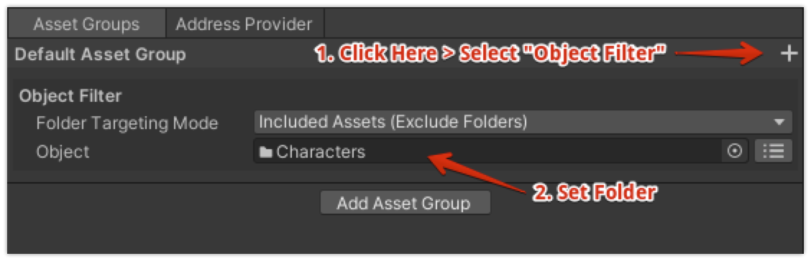

<p align="center">
  
  
</p>

# Smart Addresser: Addressableのアドレスとラベル付与自動化・バージョン管理ツール

[](LICENSE.md)
[](https://github.com/CyberAgentGameEntertainment/AssetRegulationManager/pulls)
[](#Requirements)

**ドキュメント** ([English](README.md), [日本語](README_JA.md))

**Unity** の **Addressable アセットシステム**のアドレスやラベルの付与を自動化するためのツールです。  
アドレスやラベルはGUIツールを使って、ルールベースで簡単に設定できます。  
また、リリース前のアセットをビルド対象から外すバージョン管理も備えています。

<p align="center">
  
</p>


## 目次

<!-- START doctoc generated TOC please keep comment here to allow auto update -->
<!-- DON'T EDIT THIS SECTION, INSTEAD RE-RUN doctoc TO UPDATE -->
<!-- param::title::詳細:: -->
<!-- END doctoc generated TOC please keep comment here to allow auto update -->

## コンセプト
Addressable アセットシステムでは、下図のようにアセットを **Addressables Groups ウィンドウ**にドラッグ&ドロップすることでアドレスを登録することができます。

<p align="center">
  
</p>

現実的には、全てのアセットをこのように手作業で登録するわけにはいきません。  
**Smart Addresser** はこの作業を自動化するためのツールです。  
例えば以下のようなルールを設定することで、簡単に素早くアドレスを付与できます。

- 指定したフォルダ以下の全ての Prefab にアドレスを付与する
- 「Addressables」という名前のフォルダに入れた全てのアセットにアドレスを付与する
- 指定した正規表現にマッチするパスを持つ全てのアセットにアドレスを付与する

ルールは以下のようなGUIツールを用いて自由に設定できます。

<p align="center">
  
</p>

また、**バージョン管理機能**も備えており、ビルド時にバージョンを指定することでリリース前のアセットをビルド対象から外すことができます。

設定したルールを使って実際に割り当てられるアドレスやラベル、バージョンを確認・バリデーションできるツールも用意されています。

<p align="center">
  
</p>

また、**CLI** を用いることでアドレスの付与およびバリデーションの処理を CI/CD のプロセスに組み込むことができます。

## セットアップ

### 要件

- Unity 2020.3以上
- Addressable アセットシステムがインストールされていること

### インストール

インストールは以下の手順で行います。

1. **Window > Package Manager** を選択
2. **「+」ボタン > Add package from git URL** を選択
3. 以下を入力してインストール
    - https://github.com/CyberAgentGameEntertainment/SmartAddresser.git?path=/Assets/SmartAddresser

<p align="center">
  
</p>

あるいは **Packages/manifest.json** を開き、**dependencies** ブロックに以下を追記します。

```json
{
   "dependencies": {
      "jp.co.cyberagent.smartaddresser": "https://github.com/CyberAgentGameEntertainment/SmartAddresser.git?path=/Assets/SmartAddresser"
   }
}
```

バージョンを指定したい場合には以下のように記述します（バージョンは適宜書き換えてください）。

* https://github.com/CyberAgentGameEntertainment/SmartAddresser.git?path=/Assets/SmartAddresser#1.0.0

バージョンを更新するには上述の手順でバージョンを書き換えてください。  
バージョンを指定しない場合には、**Packages/package-lock.json** ファイルを開いて本ライブラリの箇所のハッシュを書き換えることで更新できます。

```json
{
   "dependencies": {
      "jp.co.cyberagent.smartaddresser": {
         "version": "https://github.com/CyberAgentGameEntertainment/SmartAddresser.git?path=/Assets/SmartAddresser",
         "depth": 0,
         "source": "git",
         "dependencies": {},
         "hash": "..."
      }
   }
}
```

## アドレスを付与するルールを設定する

### Addressable アセットシステムをセットアップする

> **Note**  
> 既に Addressable アセットシステムをセットアップ済みの場合にはこの項目をスキップしてください

**Smart Addresser** を使う前に、Addressable アセットシステムのセットアップが完了している必要があります。  
完了していない場合には、以下の手順でセットアップを行います。

- **Window > Asset Management > Addressables > Groups** を開く
- **Addressable** の初期化が行われていない旨が表示されたら、指示に従って初期化を行う
- 必要に応じて、**Smart Addresser** で制御するための **Addressable Asset Group** を **Create > Groups** から作成する

### データを保存するためのアセットを作成する

次に Smart Addresser のデータを保存するためのアセットを作成する必要があります。  
**Assets > Create > Smart Addresser > Layout Rule Data** から**レイアウトデータアセット**を作成します。

<p align="center">
  
</p>

アドレス付与ルールはこのアセットに保存されます。

このアセットはプロジェクト内に複数作成可能です。  
また **Editor** フォルダ配下の任意の場所に配置可能です。

レイアウトデータアセットをダブルクリックするか Inspector から **Open Editor** ボタンを押下すると、**レイアウトルールエディタ**が開きます。

<p align="center">
  
</p>

### アドレスルールを作成する

レイアウトルールエディタの **Addresse Rules** タブでは、プロジェクト内の各 **Addressable Asset Group** にどのアセットを登録し、どんなアドレスを付与するか（アドレスルール）を設定できます。

**Groups** カラムには現在プロジェクト内に存在する **Addressable Asset Group** の一覧が表示されます。  
**Smart Addresser** でアドレスなどを指定したい **Addressable Asset Group** の **Control** カラムのチェックボックスにチェックを入れます。

<p align="center">
  
</p>

次にいずれかの項目を選択し、その **Addressable Asset Group** に関する設定を右側のパネルで行います。

**Asset Groups** タブでは対象とするアセットを指定することができます。  
例えば「Charactersという名前のフォルダ内の全てのアセット」を対象とするには、下図のように + ボタンを押下して **Object Filter** を選択し、**Object** プロパティに **Characters** フォルダを設定します。

<p align="center">
  
</p>

**Object Filter** 以外のフィルタの詳細は [Asset Group の Asset Filter](#asset-group-の-asset-filter) を参照してください。
また、**Object Filter** は複数指定でき、**AND** 条件で判定されます。  
**Add Asset Group** ボタンを押下すると **Asset Group** も追加でき、**Asset Group** 同士は **OR** 条件で判定されます。

**Address Provider** タブでは付与するアドレスを指定できます。  
下図のように **Source** に **File Name Without Extensions** を指定すると拡張子なしのアセット名がアドレスになります。

<p align="center">
  
</p>

各アドレスプロバイダの一覧や説明は [Address Provider](#address-provider)  を参照してください。

### ラベルルールを作成する

> **Note**  
> ラベルを使用しない場合にはこの項目をスキップしてください

レイアウトルールエディタの **Label Rules** タブでは、各アセットに Addressable アセットシステムのラベルを設定するためのルール（ラベルルール）を設定できます。

左上の **+** ボタンを押下することで新しくラベルルールを追加することができます。  
追加した項目をクリックするとリネームすることができます。

<p align="center">
  
</p>

いずれかの項目を選択すると、右側のパネルからラベルを付与するルールを設定できます。

**Asset Groups** タブでは対象とするアセットを指定することができます。   
使い方は [アドレスルールを作成する](#アドレスルールを作成する) と同様なのでこちらを参照してください。

**Label Provider** タブでは付与するラベルを指定できます。  
下図では **test** という名前のラベルを設定しています。

<p align="center">
  
</p>

**Change Provider** ボタンを押下すると他のラベルプロバイダを使用することもできます。
各ラベルプロバイダの一覧や説明は [Label Provider](#label-provider)   を参照してください。

## バリデーションする

さてこのようにルールベースでアドレスなどを指定すると、以下のような問題が起こる可能性があります。

- 一つのアセットに対して複数のアドレスが指定されている
- 一つのアドレスに対して複数のアセットが指定されている
- 一つのアドレスに対して複数の[バージョン](#バージョン管理機能)が指定されている

このようなルールの設定ミスを検知するためのツールとして、**Layout Viewer** が用意されています。

**Layout Viewer** は **Window > Smart Addresser > Layout Viewer** から開くことができます。  
**Layout Viewer** を開くとバリデーションが行われ、**Addressable Group** とそれに含まれるアドレスの一覧とバリデーション結果が表示されます。  
警告やエラーがある行を選択するとウィンドウの下部に詳細が表示されます。

<p align="center">
  
</p>

このツールを使い、警告やエラーがなくなるようにレイアウトルールを調整します。

## Addressableアセットシステムに反映する

レイアウトルールを作成してバリデーションを行ったら、実際に Addressable アセットシステムにそれを適用します。

### Layout Rule Editorから適用する

Layout Rule Editor からは以下の手順で適用することができます。

1. 右上のメニューボタンを押下する
2. **Apply to Addressables** を選択する

<p align="center">
  
</p>

### ルールを自動的に適用する
**Project Settings > Smart Addresser** の **Primary Data** に **Layout Rule Data** を設定すると、アセットがインポートされた際やルールが編集された際に、そのルールが自動的に **Addressable** アセットシステムに適用されます。

<p align="center">
  
</p>

### CLIで適用する

コマンドラインインターフェース（CLI）で適用することもできます。
詳しくは  [コマンドラインインターフェース (CLI)](#コマンドラインインターフェース-cli)  を参照してください。

## バージョン管理機能

**Smart Addresser** では、各アセットに対してバージョンを付与することができます。  
レイアウトルールを **Addressable** に適用する際にバージョンの範囲を指定することで、特定のアセットだけを **Addressable** のエントリとして登録することができます。

### バージョニングの仕様

バージョンの表現方法については [Semantic Versioning](https://semver.org/) に従います。
すなわち、以下のようなバージョンを定義することができます。

- 1.2.3
- 2.1.0-preview.7

有効なバージョンの範囲を表現する方法については、Unity の [Version Define expressions](https://docs.unity3d.com/Manual/ScriptCompilationAssemblyDefinitionFiles.html) の仕様に合わせています。  
すなわち以下のようにバージョンxの範囲を表現することができます。

- [1.3,3.4.1] は 1.3.0 <= x <= 3.4.1 を示す
- (1.3.0,3.4) は 1.3.0 < x < 3.4.0 を示す
- [1.1,3.4) は 1.1.0 <= x < 3.4.0 を示す
- (0.2.4,5.6.2-preview.2] は 0.2.4 < x <= 5.6.2-preview.2 を示す
- [2.4.5] は x = 2.4.5 を示す
- 2.1.0-preview.7 は x >= 2.1.0-preview.7 を示す
- スペースなしで入力する必要あり
- ワイルドカードは使用不可能

### バージョンを指定する

各アセットのバージョンは、レイアウトルールエディタの **Version Rules** タブから設定できます。

左上の **+** ボタンを押下することで新しくバージョンルールを追加することができます。  
追加した項目をクリックするとリネームすることができます。

<p align="center">
  
</p>

いずれかの項目を選択すると、右側のパネルからバージョンを付与するルールを設定できます。

**Asset Groups** タブでは対象とするアセットを指定することができます。
使い方は [アドレスルールを作成する](#アドレスルールを作成する) と同様なのでこちらを参照してください。

**Version Provider** タブでは付与するバージョンを指定できます。
下図では **1.2.0** という名前のバージョンを設定しています。

<p align="center">
  
</p>

**Change Provider** ボタンを押下すると他のバージョンプロバイダを使用することもできます。  
各バージョンプロバイダの一覧や説明は [Version Provider](#version-provider)  を参照してください。

### バージョンの範囲を指定して適用する

バージョンの範囲を指定して適用するには、**Layout Rule Editor** の **Settings** タブの **Version Expression** プロパティに範囲を入力します。  
**Exclude Unversioned** にチェックを入れると、バージョンが割り当てられていないアセットを適用対象外とします。  
以下は「1.2.0 以上 3.4.0 未満のバージョンが指定されたアセットおよびバージョンが割り当てられていないアセット」を適用対象としている例です。

<p align="center">
  
</p>

**Version Expression** を設定した後は通常通り適用すると、そのバージョンの範囲内のアセットが **Addressable** アセットシステムに適用されます。

### バージョン機能とアセットの依存関係について

**Smart Addresser** のバージョン管理機能は、リリース前のアセットをビルド対象から省くことを想定して作られています。  
たとえば、**[1.0.0,1.2.0]** のように指定することで、**1.2.0** より大きいバージョンのアセットをビルド対象から外します。

これを使用する上で、低いバージョンのアセットから高いバージョンのアセットへの参照が存在していないことを注意する必要があります。  
このような依存関係があるとバージョン更新時に意図しないアセットまで更新される可能性があるためです。  
例えば **1.2.0** のバージョンのアセットAが **1.3.0** のバージョンのアセットBを参照していると、**1.2.0** までのバージョンをビルド後に **1.3.0** を含めてビルドした際に、アセットBだけでなくアセットAにまで更新が入ってしまいます。

通常であればこのような依存関係は構築されないと思われますが、注意してください。

### 独自のバージョン範囲表現を使う

上述の通り、有効なバージョンの範囲を表現する方法については、Unity の [Version Define expressions](https://docs.unity3d.com/Manual/ScriptCompilationAssemblyDefinitionFiles.html) の仕様に合わせています。

`IVersionExpressionParser`を実装したクラスを作成して **Project Settings > Smart Addresser > Version Expression Parser** にそのスクリプトをアサインすることで、独自のバージョン範囲表現を使うこともできます。

## コマンドラインインターフェース (CLI)

### Version Expressionを設定する

コマンドラインから **Version Expression** を設定するには`SmartAddresser.Editor.Core.Tools.CLI.SmartAddresserCLI.SetVersionExpression`を呼びます。

以下はMacでコマンドライン実行を行う例です。

```
/Applications/Unity/Hub/Editor/2020.3.40f1/Unity.app/Contents/MacOS/Unity -projectPath [Your Project Path Here] -executeMethod Assets/SmartAddresser/Editor/Core/Tools/CLI/SmartAddresserCLI.SetVersionExpression
```

コマンドライン引数は以下の通りです。

| 引数名                               | 説明                                                    |
|-----------------------------------|-------------------------------------------------------|
| -layoutRuleAssetPath \<assetPath\> | 適用するレイアウトルールデータのアセットパス。<br>指定されない場合は最初に見つかったものを使用します。 |
| -versionExpression \<versionExpression\> | 設定する Version Expression。                              |

実行が完了すると自動的にUnityを終了し、戻り値として以下の値を返します。

- 実行が成功した場合: 0
- 実行中にエラーが発生した場合: 2

### レイアウトルールを Addressables に反映する

コマンドラインからレイアウトルールを反映するには `SmartAddresser.Editor.Core.Tools.CLI.SmartAddresserCLI.ApplyRules` を呼びます。

以下はMacでコマンドライン実行を行う例です。

```
/Applications/Unity/Hub/Editor/2020.3.40f1/Unity.app/Contents/MacOS/Unity -quit -batchmode -projectPath /Users/s14774/Unity/SmartAddresser_Sample -executeMethod SmartAddresser.Editor.Core.Tools.CLI.SmartAddresserCLI.ApplyRules
```

コマンドライン引数は以下の通りです。

| 引数名                             | 説明                                                                                                      |
|---------------------------------|---------------------------------------------------------------------------------------------------------|
| -layoutRuleAssetPath \<assetPath\> | 適用するレイアウトルールデータのアセットパス。<br>指定されない場合は最初に見つかったものを使用します。                                                   |
| -validate                       | このオプションを有効にした場合、反映する前にバリデーションが実行されます。<br>バリデーションは処理時間のかかるプロセスであるため、レイアウトルールに問題がないことが保証されている場合にはスキップできます。 |
| -resultFilePath \<filePath\>      | バリデーション結果の出力ファイルパス。<br>デフォルトはSmartAddresser/validate_result.json。                                       |
| -failWhenWarning                | このオプションを有効にした場合、バリデーションで警告が発生した場合に実行エラーとみなします。                                                          |

実行が完了すると自動的にUnityを終了し、戻り値として以下の値を返します。

- 実行が成功した場合: 0
- バリデーションが失敗した場合: 1
- 実行中にエラーが発生した場合: 2

## スクリプティング

**Smart Addresser** の各種操作はスクリプトから行うこともできます。

### レイアウトルールデータを編集する

以下はスクリプトからレイアウトルールデータを操作する例です。

```cs
using System.Linq;
using SmartAddresser.Editor.Core.Models.LayoutRules;
using SmartAddresser.Editor.Core.Models.LayoutRules.AddressRules;
using SmartAddresser.Editor.Core.Models.LayoutRules.LabelRules;
using SmartAddresser.Editor.Core.Models.LayoutRules.VersionRules;
using SmartAddresser.Editor.Core.Models.Shared;
using SmartAddresser.Editor.Core.Models.Shared.AssetGroups.AssetFilterImpl;
using UnityEditor;
using UnityEditor.AddressableAssets.Settings;

public static class Example
{
    private const string LayoutRuleDataAssetPath = "Assets/LayoutRuleData.asset";
    private const string AddressableAssetGroupAssetPath = "Assets/AddressableAssetsData/AssetGroups/ExampleGroup.asset";

    [MenuItem("Tools/Smart Addresser/Example/Setup Layout Rule Data")]
    public static void SetupLayoutRuleDataProgramatically()
    {
        // Load LayoutRuleData
        var data = AssetDatabase.LoadAssetAtPath<LayoutRuleData>(LayoutRuleDataAssetPath);

        // Remove & Add AddressRule
        var group = AssetDatabase.LoadAssetAtPath<AddressableAssetGroup>(AddressableAssetGroupAssetPath);
        var addressRule = data.LayoutRule.AddressRules.FirstOrDefault(x => x.AddressableGroup == group);
        if (addressRule != null)
            data.LayoutRule.AddressRules.Remove(addressRule);
        addressRule = CreateAddressRule(group);
        data.LayoutRule.AddressRules.Add(addressRule);

        // Add LabelRule
        data.LayoutRule.LabelRules.Add(CreateLabelRule());

        // Add VersionRule
        data.LayoutRule.VersionRules.Add(CreateVersionRule());

        EditorUtility.SetDirty(data);
        AssetDatabase.SaveAssets();
    }

    private static AddressRule CreateAddressRule(AddressableAssetGroup group)
    {
        // Create new AddressRule.
        var addressRule = new AddressRule(group);

        // Set the Control property true to activate this rule.
        addressRule.Control.Value = true;

        // Set the target assets of this rule.
        // In this case, all png files are targeted.
        var assetGroup = addressRule.AssetGroups[0];
        var assetFilter = new ExtensionBasedAssetFilter();
        assetFilter.Extension.Value = "png";
        assetGroup.Filters.Add(assetFilter);

        // Set the address pattern of this rule.
        // In this case, set the asset name as the address.
        var addressProvider = new AssetPathBasedAddressProvider();
        addressProvider.Source = PartialAssetPathType.FileName;
        addressRule.AddressProvider.Value = addressProvider;

        return addressRule;
    }

    private static LabelRule CreateLabelRule()
    {
        var labelRule = new LabelRule();
        labelRule.Name.Value = "NormalMap";

        // Set the target assets of this rule.
        // In this case, all files that contains "_Normal" in the name are targeted.
        var assetGroup = labelRule.AssetGroups[0];
        var assetFilter = new RegexBasedAssetFilter();
        assetFilter.AssetPathRegex.Value = "_Normal";
        assetGroup.Filters.Add(assetFilter);

        // Set the label provider.
        // In this case, set the label "NormalMap".
        var labelProvider = new ConstantLabelProvider();
        labelProvider.Label = "NormalMap";
        labelRule.LabelProvider.Value = labelProvider;

        return labelRule;
    }

    private static VersionRule CreateVersionRule()
    {
        var versionRule = new VersionRule();
        versionRule.Name.Value = "1.0.0";

        // Set the target assets of this rule.
        // In this case, all files that contains "Ellen" in the name are targeted.
        var assetGroup = versionRule.AssetGroups[0];
        var assetFilter = new RegexBasedAssetFilter();
        assetFilter.AssetPathRegex.Value = "Ellen";
        assetGroup.Filters.Add(assetFilter);

        // Set the version provider.
        // In this case, set the version "1.0.0".
        var versionProvider = new ConstantVersionProvider();
        versionProvider.Version = "1.0.0";
        versionRule.VersionProvider.Value = versionProvider;

        return versionRule;
    }
}
```

### バリデーション・Addressableへの適用をする

以下はバージョンを設定し、バリデーションし、Addressable に適用する例です。

```cs
using System;
using System.Linq;
using SmartAddresser.Editor.Core.Models.LayoutRules;
using SmartAddresser.Editor.Core.Models.Layouts;
using SmartAddresser.Editor.Core.Models.Services;
using SmartAddresser.Editor.Core.Tools.Shared;
using SmartAddresser.Editor.Foundation.AddressableAdapter;
using SmartAddresser.Editor.Foundation.AssetDatabaseAdapter;
using UnityEditor;
using UnityEditor.AddressableAssets;

public static class Example
{
    private static void Apply()
    {
        var layoutRuleData = LoadLayoutRuleData();
        var layoutRule = layoutRuleData.LayoutRule;
        var versionExpressionParser = new VersionExpressionParserRepository().Load();
        var assetDatabaseAdapter = new AssetDatabaseAdapter();
        var addressableSettings = AddressableAssetSettingsDefaultObject.Settings;
        var addressableSettingsAdapter = new AddressableAssetSettingsAdapter(addressableSettings);

        // Set Version Expression
        {
            // Set the version expression.
            layoutRule.Settings.VersionExpression.Value = "1.3.0";

            // Save the LayoutRuleData asset.
            EditorUtility.SetDirty(layoutRuleData);
            AssetDatabase.SaveAssets();
        }

        // Validation
        {
            // Build and validate the Layout.
            var buildLayoutService = new BuildLayoutService(assetDatabaseAdapter);
            var layout = buildLayoutService.Execute(layoutRule);
            layout.Validate(true);

            // Export the result of the validation.
            var validateResultExportService = new ValidateResultExportService(layout);
            validateResultExportService.Run("Smart Addresser/validate-result.json");

            // Throw exception if the validation failed.
            if (layout.ErrorType == LayoutErrorType.Error || layout.ErrorType == LayoutErrorType.Warning)
                throw new Exception($"Validation failed: {layout.ErrorType}");
        }

        // Apply
        {
            // Apply the layout rules to the addressable asset system.
            var applyService = new ApplyLayoutRuleService(layoutRule, versionExpressionParser,
                addressableSettingsAdapter, assetDatabaseAdapter);
            applyService.UpdateAllEntries();
        }
    }

    private static LayoutRuleData LoadLayoutRuleData(string assetPath = null)
    {
        if (!string.IsNullOrEmpty(assetPath))
            return AssetDatabase.LoadAssetAtPath<LayoutRuleData>(assetPath);

        var guid = AssetDatabase.FindAssets($"t: {nameof(LayoutRuleData)}").FirstOrDefault();
        if (string.IsNullOrEmpty(guid))
            throw new InvalidOperationException("There is no LayoutRuleData in the project.");

        assetPath = AssetDatabase.GUIDToAssetPath(guid);
        return AssetDatabase.LoadAssetAtPath<LayoutRuleData>(assetPath);
    }
}
```

## アセットフィルタ、プロバイダの一覧と説明

### Asset Group の Asset Filter

| 名前                      | 概要と各プロパティの説明                                                                                                                                                                                                                                                                                                                                                                                                                                                                                                                               |
|-------------------------|--------------------------------------------------------------------------------------------------------------------------------------------------------------------------------------------------------------------------------------------------------------------------------------------------------------------------------------------------------------------------------------------------------------------------------------------------------------------------------------------------------------------------------------------|
| Object Filter           | アセットを直接指定してフィルタリングします。<br>使用例: Characters フォルダ以下のアセットだけをレギュレーションの対象とする。<br><br>**Folder Targeting Mode**<br>フォルダを指定した時の扱いを指定します。<br>・Included Assets (Exclude Folders): フォルダ内のアセットのみ対象とする<br>・Self: フォルダ自身のみを対象とする<br>・Both: フォルダと中のアセットの両方を対象とする<br><br>**Object**<br>対象のアセット。<br>フォルダを指定した場合にはそのフォルダ以下の全てのアセットが対象となります。<br>右側のトグルを切り替えることで複数指定することができます。                                                                                                                                                                                 |
| Type Filter             | アセットの型を指定してフィルタリングします。<br>使用例: Texture2D 型のアセットだけをレギュレーションの対象とする。<br><br>**Match With Derived Type**<br>チェックをつけると派生型も対象とします。<br><br>**Type**<br>対象の型。<br>右側のトグルを切り替えることで複数指定することもできます。                                                                                                                                                                                                                                                                                                                                                     |
| Asset Path Filter       | アセットパスを指定してフィルタリングします。<br>使用例1: Assets/Sample[任意の3文字]/ というフォルダに含まれるアセットを対象とする<br>使用例2: ファイル名に「Dummy」を含むものを対象から除外する<br><br>**Match With Folders**<br>フォルダを対象とするか。<br><br>**Asset Path (Regex)**<br>対象のアセットパス。<br>これにパスが部分一致するアセットが対象となります。<br>正規表現を使用することもできます。<br>右側のトグルを切り替えることで複数指定することもできます。<br><br>**Condition**<br>Asset Pathを複数指定する場合の取り扱い方を指定できます。<br>・Contains Matched: いずれかのアセットパスがマッチしたら対象とする<br>・Match All: 全てのアセットパスがマッチしたら対象とする<br>・Contains Unmatched: マッチしないアセットパスが一つでもあれば対象とする<br>・Not Match All: 全てのアセットパスにマッチしなかったら対象とする |
| Extension Filter        | アセットの拡張子を指定してフィルタリングします。<br>使用例: png あるいは jpg ファイルだけをレギュレーションの対象にする<br><br>**Extension**<br>対象の拡張子。<br>右側のトグルを切り替えることで複数指定することもできます。                                                                                                                                                                                                                                                                                                                                                                                                       |
| Dependent Object Filter | 指定したアセットから参照されているアセットをフィルタリングします。<br>使用例: あるPrefabが参照するテクスチャを全て対象とする。<br><br>**Only Direct Dependencies**<br>直接参照しているアセットのみを対象とします。<br><br>**Object**<br>参照元のアセット。                                                                                                                                                                                                                                                                                                                                                                         |
| Find Assets Filter      | AssetDatabase.FindAssets()を用いてアセットをフィルタリングします。<br/><br/>**Filter**<br>AssetDatabase.Find()に渡すフィルタ文字列。<br><br>**Target Folders**<br>検索対象とするフォルダ。<br>指定しない場合全てのフォルダが対象となります。                                                                                                                                                                                                                                                                                                                                                                 |

### Address Provider

| 名前                                | 概要と各プロパティの説明                                                                                                                                                                                                                                                                   |
|-----------------------------------|--------------------------------------------------------------------------------------------------------------------------------------------------------------------------------------------------------------------------------------------------------------------------------|
| Asset Path Based Address Provider | 対象アセットのアセットパスを元にアドレスを付与します。<br><br>**Source**<br>以下のパターンからアドレスを指定します。<br>・File Name: 拡張子付きファイル名<br>・File Name Without Extensions: 拡張子なしアセット名<br>・Asset Path: アセットパス<br><br>**Replace With Regex**<br>チェックをつけると、Pattern を元に正規表現を作成し、Source を Replacement で Regex.Replace したものをアドレスとします。 |

### Label Provider

| 名前                              | 概要と各プロパティの説明                                                                                                                                                                                                                                                                |
|---------------------------------|-----------------------------------------------------------------------------------------------------------------------------------------------------------------------------------------------------------------------------------------------------------------------------|
| Constant Label Provider         | 固定値でラベルを付与します。<br><br>Label<br>付与するラベルの名前。                                                                                                                                                                                                                                  |
| Asset Path Based Label Provider | 対象アセットのアセットパスを元にラベルを付与します。<br><br>**Source**<br>以下のパターンからラベルを指定します。<br>・File Name: 拡張子付きファイル名<br>・File Name Without Extensions: 拡張子なしアセット名<br>・Asset Path: アセットパス<br><br>**Replace With Regex**<br>チェックをつけると、Pattern を元に正規表現を作成し、Source を Replacement で Regex.Replace したものをラベルとします。 |

### Version Provider

| 名前 | 概要と各プロパティの説明 |
| --- | --- |
| Constant Version Provider | 固定値でバージョンを付与します。<br><br>Label<br>付与するバージョンの名前。 |
| Asset Path Based Version Provider | 対象アセットのアセットパスを元にバージョンを付与します。<br><br>**Source**<br>以下のパターンからバージョンを指定します。<br>・File Name: 拡張子付きファイル名<br>・File Name Without Extensions: 拡張子なしアセット名<br>・Asset Path: アセットパス<br><br>**Replace With Regex**<br>チェックをつけると、Pattern を元に正規表現を作成し、Source を Replacement で Regex.Replace したものをバージョンとします。 |

## 独自のアセットフィルタ、プロバイダを作成する

### 独自のアセットフィルタを作成する
独自のアセットフィルタを作成するにはまず **AssetFilterAsset** を継承したクラスを作成します。

```cs
using System;
using SmartAddresser.Editor.Core.Models.Shared.AssetGroups.AssetFilterImpl;

public sealed class ExampleAssetFilter : AssetFilterAsset
{
    public override void SetupForMatching()
    {
        // IsMatchの前に呼ばれる処理
        // IsMatchがアセットごとに呼ばれるのに対して、この処理は一度だけ呼ばれる
        // したがって重い処理はここで行う
    }

    public override bool IsMatch(string assetPath, Type assetType, bool isFolder)
    {
        // 引数に与えられたアセットがこのフィルタにマッチしていたらtrueを返す
    }

    public override string GetDescription()
    {
        // このフィルタの状態を文字列で返す（エディタ用）
    }
}
```

次にこのクラスの **ScriptableObject** アセットを作成します（**AssetFilterAsset** は **ScriptableObject** を継承しています）。

最後に **Layout Rule Editor** の **Asset Group** に **Example Asset Filter** を追加し、**Asset Filter** プロパティに先ほど作った **ScriptableObject** をアサインすれば完了です。

<p align="center">
  
</p>

### 独自のプロバイダを作成する
独自のプロバイダを作成するにはまず、**AddressProviderAsset** / **LabelProviderAsset** / **VersionProviderAsset** のいずれかを継承したクラスを実装します。

```cs
using System;
using SmartAddresser.Editor.Core.Models.LayoutRules.AddressRules;
using UnityEngine;

public sealed class ExampleAddressProvider : AddressProviderAsset
{
    public override void Setup()
    {
        // Provideの前に呼ばれる処理
        // Provideがアセットごとに呼ばれるのに対して、この処理は一度だけ呼ばれる
        // したがって重い処理はここで行う
    }

    public override string Provide(string assetPath, Type assetType, bool isFolder)
    {
        // 引数に与えられたアセットに対応するアドレスを返す
        // 該当するアドレスが無い場合にはnullを返す
    }

    public override string GetDescription()
    {
        // このフィルタの状態を文字列で返す（エディタ用）
    }
}
```

次にこのクラスの **ScriptableObject** アセットを作成します（各**ProviderAsset** は **ScriptableObject** を継承しています）。

最後に **Layout Rule Editor** の 各 **Provider** の **Change Provider** ボタンを押下してから **Custom Provider** を選択し、**Address Provider** プロパティに先ほど作った **ScriptableObject** をアサインすれば完了です。

<p align="center">
  
</p>

## ライセンス
本ソフトウェアはMITライセンスで公開しています。  
ライセンスの範囲内で自由に使っていただけますが、使用の際は以下の著作権表示とライセンス表示が必須となります。

* [LICENSE.md](LICENSE.md)

また、本ドキュメントの目次は以下のソフトウェアを使用して作成されています。

* [toc-generator](https://github.com/technote-space/toc-generator)

toc-generatorのライセンスの詳細は [Third Party Notices.md](Third%20Party%20Notices.md) を参照してください。
